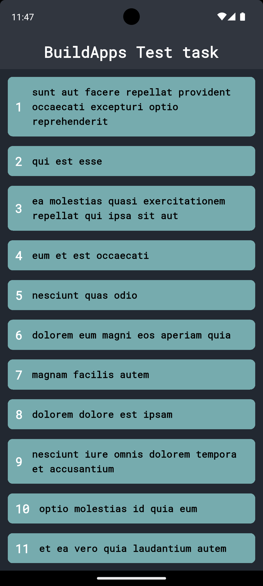
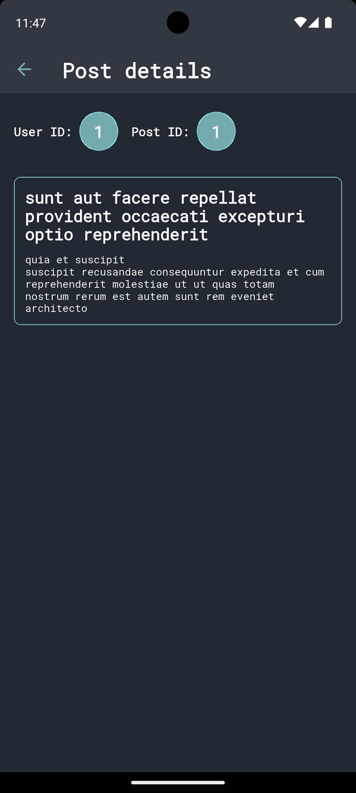

# BuildApps LLC Test task

## 🛠 Tech Stack

* **State Management:** Cubit (Bloc)
* **Dependency Injection:** GetIt
* **Networking:** Dio
* **API:** [JSONPlaceholder](https://jsonplaceholder.typicode.com/)

## 🚀 How to lauch

TERMINAL:
1. git clone https://github.com/yatsiv54/build-apps-test
2. cd build-apps-test
3. flutter pub get
4. flutter pub run build_runner build --delete-conflicting-outputs
5. flutter run

## 📸 Screenshots

  
  

